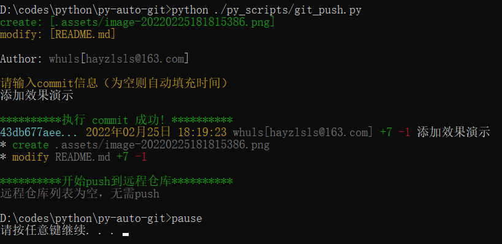
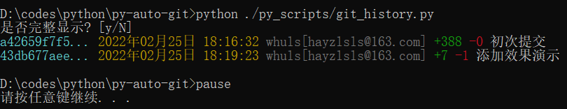
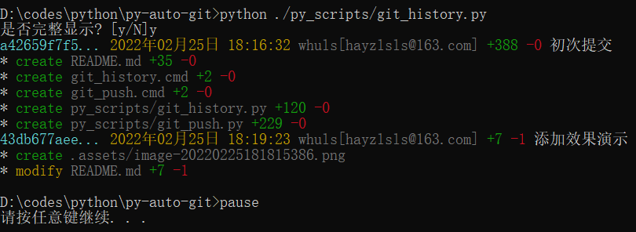
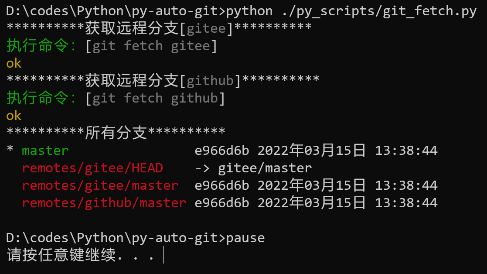
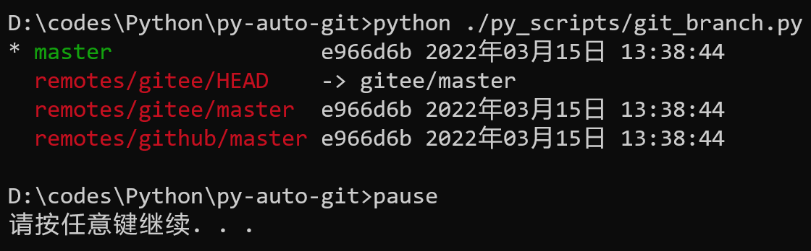
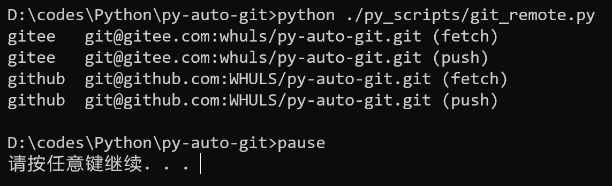

# py-auto-git

基于pygit2的python自动化脚本

|脚本|功能|
|---|---|
|git_push.py|自动push|
|git_history.py|查看历史记录|
|git_fetch.py|获取所有远程仓库|
|git_branch.py|查看所有分支|
|git_remote.py|查看远程仓库列表|

# 运行

## Windows

点击`git_*.cmd`文件直接执行

## 其他

```shell
python py_scripts/git_*.py
```

## 依赖

- pygit2 - 操作git仓库
- colorama - 在命令行显示颜色

# 安装与部署

在python中安装相关依赖后，直接拷贝脚本到你的git仓库中即可运行。

建议将以下两行添加到`.gitignore`：

```properties
git_*.cmd
git_*.py
```

# 效果演示

## git_push



## git_history

one-line:



full:



## git_fetch



## git_branch



## git_remote


